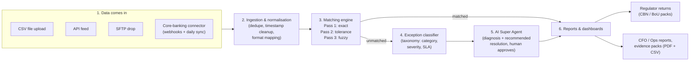
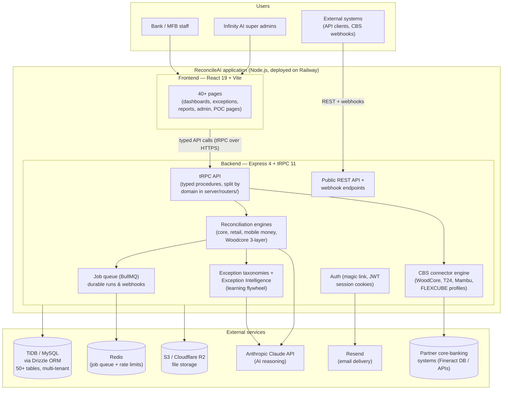

# ReconcileAI — Technical Handover & Architecture Guide

**Prepared for:** Incoming technical team
**Prepared by:** Richard Anwanakak, Founder & CEO — Infinity AI Africa Limited
**Date:** July 2026
**Status:** Current — supersedes `docs/ARCHITECTURE.md` (v2.0, May 2026) for onboarding purposes

---

## How to read this document

This document explains ReconcileAI from the ground up. It is written so that a
non-technical reader can follow every section, while still giving an engineer
everything they need to start working on the codebase. Technical terms are
explained the first time they appear, and there is a glossary at the end.

If you are an engineer joining the project, read this document first, then:

1. [`docs/DEVELOPER_GETTING_STARTED.md`](DEVELOPER_GETTING_STARTED.md) — how to run the app locally
2. [`CLAUDE.md`](../CLAUDE.md) (repo root) — the living engineering context file, updated continuously
3. [`docs/GAP_CLOSURE_PLAN.md`](GAP_CLOSURE_PLAN.md) — the active engineering roadmap

---

## 1. What ReconcileAI is (in plain English)

### The problem it solves

Every day, a bank's money moves through many different channels: card machines
(POS), bank transfers, mobile money, ATMs, USSD, agent networks, and more. Each
channel keeps its own record of what happened. At the end of the day, the bank
must check that all those records **agree with each other** — that the money the
card processor says it sent actually arrived, that no transaction was counted
twice, that no fees were overcharged.

This checking process is called **reconciliation**. Today, most African banks
do it manually: teams of people comparing spreadsheets, line by line, often
days behind. Mistakes slip through. Regulators (like the Central Bank of
Nigeria) fine banks for unresolved discrepancies. Fraud hides in the gaps.

### What ReconcileAI does

ReconcileAI automates this entire process:

1. **Ingests** transaction records from every channel a bank uses (file
   uploads, direct system connections, automated feeds).
2. **Matches** records against each other automatically, using a multi-pass
   matching engine (exact match first, then tolerance-based, then fuzzy
   matching for near-misses).
3. **Flags exceptions** — anything that doesn't match — and classifies each one
   by type and severity using a purpose-built taxonomy of known failure modes
   (e.g. "duplicate settlement", "fee overcharge", "missing reversal").
4. **Recommends resolutions** using an AI agent (the "Super Agent") that has
   been given deep domain knowledge about each type of exception, the relevant
   regulations, and the bank's own resolution history.
5. **Produces reports** that operations teams, CFOs, and regulators can act on —
   including regulator-formatted returns for the Central Bank of Nigeria (CBN)
   and Bank of Uganda (BoU).

### The strategic moat

The product strategy (documented in `CLAUDE.md` §9A) is that **intelligence
depth beats feature breadth**. Any competitor can build transaction matching.
What is hard to replicate is:

- A per-vertical **exception taxonomy** (25+ categories for retail commerce,
  22 for Uganda, dedicated taxonomies for mobile money, banking, etc.), each
  with severity, resolution SLA, regulatory context, and AI diagnosis guidance.
- A **learning flywheel**: the system records how each institution resolves
  each exception type and feeds that back into future recommendations
  (per-institution memory plus an anonymised cross-institution pattern pool).
- **Regulator-ready output**: signed, audit-trailed reports formatted for the
  actual returns regulators require.

Every proposed feature is evaluated against one question: *does this make the
AI's recommendations more accurate, more personalised, or harder to replicate?*
Features that only add breadth are deprioritised.

---

## 2. Current status at a glance

| Item | Status |
|---|---|
| **Live production site** | https://www.reconcileaiafrica.com/ (hosted on Railway) |
| **Health check** | `https://www.reconcileaiafrica.com/api/health` |
| **Stage** | Working product, live pilots/POCs in progress; hardening for scale |
| **GitHub repos** | `Infinity-AI-Africa-Limited/reconcileai` (primary) and `MistaRichMan/reconcileai` (mirror) — **every commit is pushed to both** |
| **Active pilot track** | Woodcore (Nigerian core-banking provider on Apache Fineract) — POC → paid pilot conversion |
| **Other commercial tracks** | LAPO MFB (channel pack shipped, awaiting real data samples), Uganda market entry (channel pack + BoU reports shipped), SHOPLINE retail partnership (Phase 0 + Phase 1 **merged & live on production**; App Store submission is the only remaining step — see §7.4) |
| **Authentication** | Passwordless email "magic link" login — live |
| **Background job queue** | Code complete (BullMQ); needs a Redis instance provisioned on Railway to activate |

> **Note on domains:** older documents reference `reconcileai.vip`. The live
> production domain is **reconcileaiafrica.com**, deployed on Railway. Treat
> any `reconcileai.vip` references in older docs as historical.

---

## 3. The product walkthrough (what actually happens)

Here is the life of one reconciliation run, in plain English:



1. **Data comes in.** A bank uploads a CSV export, pushes data through the
   public API, drops files on an SFTP server, or — for banks onboarded through
   a core-banking-system (CBS) partner — data flows in automatically through a
   connector (real-time webhooks plus a daily batch sync).
2. **Ingestion normalises everything**: duplicate records are detected and
   skipped, timestamps are standardised to UTC, and each source's field names
   are mapped to a single canonical transaction format.
3. **The matching engine runs three passes**: exact matches first, then matches
   within configured tolerances (small amount/date differences), then fuzzy
   matching for near-misses. Runs execute through a durable job queue, so a
   server restart never loses a run.
4. **Whatever doesn't match becomes an exception.** Each exception is
   classified against the vertical-specific taxonomy — e.g. for a bank:
   "settlement shortfall, critical severity, 24-hour resolution SLA, relevant
   CBN circular attached."
5. **The AI Super Agent diagnoses each exception** and drafts a recommended
   resolution. Importantly, the agent **proposes; a human approves** — drafted
   actions sit in an approval queue before anything is executed. The agent
   learns from each institution's resolution history.
6. **Reports are generated**: operations dashboards, shareable CFO reports,
   one-click evidence packs (PDF + CSV), and regulator-formatted returns.

---

## 4. System architecture

### 4.1 The big picture

ReconcileAI is **one application** (a "monorepo" — all code in a single
repository) with a clear separation between the part users see (the frontend),
the part that does the work (the backend), and the services it relies on.



### 4.2 What each piece is, in plain English

**Frontend (what users see).** Built with React, the most widely used
framework for web interfaces. It has 40+ pages: dashboards, exception queues,
report builders, admin panels, and public proof-of-concept pages for
prospects. Styling uses Tailwind CSS with the shadcn/ui component library —
a standard, well-supported stack any React developer knows.

**API layer (how frontend and backend talk).** The app uses **tRPC**, which
gives the frontend and backend a shared, typed contract — if the backend
changes what a procedure returns, the frontend build fails immediately instead
of breaking silently in production. All API procedures live under
`server/routers/` (split by domain) with the main router map in
`server/routers.ts`.

**Reconciliation engines (the core product).** The matching and exception
logic. There is one core engine (`server/reconciliationEngine.ts`) plus
thin adapters per vertical — retail commerce, mobile money, and the
Woodcore/Fineract three-layer engine (`server/woodcore-engine.ts`). Adapters
**wrap** the core engine rather than forking it, so matching improvements
benefit every vertical at once.

**Exception intelligence (the moat).** Per-vertical taxonomies live in
`server/exceptions/`, and the learning flywheel in
`server/exceptionIntelligence.ts` + `server/institutionalLearning.ts`:
resolution history per institution, agent memory, and an anonymised
cross-institution pattern pool.

**Job queue (reliability).** Long-running reconciliation runs and inbound
webhooks are processed through **BullMQ**, a Redis-backed job queue. If the
server restarts mid-run, the job resumes safely (retry-safe artifact reset +
a boot sweep for orphaned runs). The code is complete; it activates when a
`REDIS_URL` is provisioned (falls back to in-process execution without it).

**Database.** A MySQL-compatible managed database (TiDB Cloud) accessed
through **Drizzle ORM** — meaning all database access goes through typed
TypeScript definitions in `drizzle/schema.ts` (50+ tables), never raw SQL
strings. Schema changes are applied through versioned migration files, which
run automatically on deploy.

**File storage.** All files (uploaded CSVs, generated PDFs, export packets)
are stored in S3-compatible object storage — never in the database.

**AI (LLM) layer.** All AI calls go through **one helper function**,
`invokeLLM()` in `server/_core/llm.ts`. It is dual-mode: it uses the Anthropic
Claude API in production (`DIRECT_LLM_API_KEY`) and falls back to the legacy
prototyping provider otherwise. Because all 20+ call sites use this single
helper, swapping models or providers is a one-line environment change.

**Email.** Login links, invites, alerts, and CFO report deliveries are sent
via Resend. Without email credentials configured, all email becomes a safe
no-op (logged, never crashes) — useful for local development.

### 4.3 Multi-tenancy: one app, many isolated customers

ReconcileAI is **multi-tenant**: every bank, merchant, or partner is an
`organization` in the database, and every piece of data belongs to exactly one
organization. Tenants never see each other's data. Enforcement is layered:

- Every API procedure resolves the caller's organization from their session
  and scopes all queries to it.
- A **row-level-security ratchet** in CI: every new database table must be
  classified for tenant scoping or the build fails — so tenant isolation
  cannot silently regress.
- Per-tenant encryption envelope keys and per-tenant rate limits (Redis-gated).

There are four user segments (portals), all served by the same codebase:

| Segment | Who | What they see |
|---|---|---|
| `financial_services` | Banks, MFBs, payment processors | Reconciliation, exceptions, CBN/BoU reports, channels, compliance |
| `corporate_b2b` | FMCG distributors, supply-chain finance | Distributor registry, B2B-specific navigation |
| `retail_commerce` | E-commerce merchants (SHOPLINE vertical) | Merchant dashboards (Phase 1, gated — see §7.4) |
| `super_admin` | Infinity AI (us) | Cross-tenant operations: all organisations, onboarding, module overrides, POC hub |

Super admins can "enter" any organisation's portal and see the app exactly as
that customer sees it (the portal context switcher) — essential for support
and sales demos.

### 4.4 The two reconciliation modules

The product has exactly **two** modules (deliberately reduced from three):

| Module | Key | What it does |
|---|---|---|
| **Settlement Reconciliation** | `settlement` | Validates bulk settlement amounts against detailed transaction reports. Includes all transaction-integrity capabilities: multi-source ingestion, duplicate detection, timestamp normalisation, 5–6-system matching. |
| **Account-Level Reconciliation** | `account_level` | General-ledger-to-core-banking balance reconciliation at account and product level. The heart of the Woodcore pilot. |

Modules can be toggled per organisation, and super admins can force them
on/off per institution. **Rule:** transaction integrity is part of settlement —
it must never reappear as a third module in any user-facing dropdown.

---

## 5. Technology stack

| Layer | Technology | Plain-English explanation |
|---|---|---|
| Language | TypeScript (strict mode) | JavaScript with a type system that catches whole classes of bugs at build time. "Strict mode" means no escape hatches (`any`, `ts-ignore`) are allowed. |
| Runtime | Node.js 22 | The engine that runs the server code. |
| Frontend | React 19 + Vite | Industry-standard UI framework + a fast build tool. |
| Styling | Tailwind CSS 4 + shadcn/ui | Utility CSS + a high-quality component library. Consistent look with minimal custom CSS. |
| API | tRPC 11 | Typed frontend↔backend contract (see §4.2). |
| Server | Express 4 | The standard Node.js web server framework. |
| Database | TiDB (MySQL-compatible) via Drizzle ORM | Managed cloud database; all access is typed TypeScript, never raw SQL. |
| Job queue | BullMQ + Redis | Durable background processing for reconciliation runs and webhooks. |
| File storage | S3 / Cloudflare R2 | Object storage for all files. |
| AI | Anthropic Claude (via `invokeLLM()`) | Sonnet-class models for classification/reports; Opus-class for the multi-step Super Agent. |
| Email | Resend | Transactional email (login links, alerts, reports). |
| Auth | Magic link + JWT session cookies | Passwordless login (see §8). |
| Testing | Vitest | Unit/integration test framework; extensive coverage across engines, routers, and reports. |
| Hosting | Railway | Deploys automatically from GitHub; migrations run on deploy. |

Key commands (from `package.json`):

```bash
pnpm dev        # run locally with hot reload
pnpm check      # TypeScript type-check (must be 0 errors)
pnpm test       # run the full Vitest suite
pnpm build      # production build (frontend + backend)
pnpm start      # run the production build
pnpm db:push    # generate + apply database migrations
```

> **Local environment caution:** the local `.env` may contain the **live**
> shared database URL. Database-touching tests snapshot/restore, but be
> deliberate before running anything destructive locally.

---

## 6. Codebase map

```
reconcileai/
├── client/src/
│   ├── pages/                  # 40+ frontend pages
│   ├── components/             # shared UI, incl. DashboardLayout (sidebar/portals)
│   ├── contexts/PortalContext  # super-admin "view as org" switcher
│   └── App.tsx                 # routes
├── server/
│   ├── _core/                  # framework plumbing: env, LLM helper, auth,
│   │                           #   server entry — DO NOT casually modify
│   ├── routers.ts              # main tRPC router map
│   ├── routers/                # domain routers (uganda, lapo, poc, cbn,
│   │                           #   mobileMoney, woodcoreConnector, erpExport…)
│   ├── reconciliationEngine.ts # core 3-pass matching engine
│   ├── retailReconciliationEngine.ts / mobileMoney-engine.ts / woodcore-engine.ts
│   ├── exceptions/             # per-vertical exception taxonomies
│   ├── exceptionIntelligence.ts / institutionalLearning.ts   # learning flywheel
│   ├── connectors/             # CBS connector engine + per-platform registry
│   ├── jobQueue.ts / reconciliationQueue…  # BullMQ durable jobs
│   ├── cbnReports.ts / bouReports.ts       # regulator report packs
│   └── *.test.ts               # extensive Vitest coverage, colocated
├── drizzle/
│   ├── schema.ts               # all 50+ tables (single source of truth)
│   ├── woodcore_schema.ts      # read-only mirror of Fineract tables
│   └── 00xx_*.sql              # versioned migrations (auto-run on deploy)
├── shared/                     # constants shared by client+server
│   ├── roiModel.ts             # pricing single-source (public ROI calculator)
│   └── shoplineConstants.ts    # SHOPLINE tiers/pricing/scopes
├── deploy/                     # on-prem / air-gapped deployment pack
├── ml/                         # local model training assets (on-prem track)
├── docs/                       # PRD, runbooks, market docs, this file
└── CLAUDE.md                   # living engineering context (read it!)
```

---

## 7. Business verticals and integration tracks

This section explains the commercial context an engineer needs, because the
codebase is organised around these tracks.

### 7.1 Woodcore (the active pilot — highest priority)

**Woodcore** is a Nigerian core-banking platform built on Apache Fineract
(open-source banking software). ReconcileAI has a live test tenant with
direct database access to a Fineract instance. The goal: convert the POC into
a **paid pilot** by demonstrating live reconciliation of real savings, loan,
and general-ledger data, with accurate exception detection and an actionable
CFO-ready report.

- Engine: `server/woodcore-engine.ts` (three layers: balance → exception → agent)
- DB access: `server/woodcoreDb.ts` (direct MySQL — production path is the
  Fineract REST API instead; this is a known migration item)
- Frontend: `client/src/pages/WoodcorePOC.tsx` (public demo page, intentionally unauthenticated)

### 7.2 CBS connectors — the onboarding channel model

The core strategic insight: a core-banking-system (CBS) partner is not just a
data source, it is a **distribution channel**. When a CBS partner refers a
client bank, that bank is onboarded *through the connector* in one step:
organisation created + admin invited + connector configured + data channel
established (`onboardCbsClient()` in `server/connectors/woodcore/onboarding.ts`).

- **One engine, four platforms**: WoodCore (live/tested), Temenos T24, Mambu,
  Oracle FLEXCUBE. The engine (auth, webhooks, batch sync, dead-letter queue,
  health checks, canonical ingest) is shared; per-platform differences are
  **data** in a registry (`server/connectors/cbs/registry.ts`), not code forks.
  Adding a new CBS platform = adding a registry profile.
- **CSV fallback**: every connector accepts CSV exports through the same
  mapping + dedupe pipeline, so a client is productive before API credentials
  exist — and switching to the API later never double-ingests.
- **Onboarding hub**: the "New Organisation" dialog in the super-admin portal
  offers "Direct" vs "Via Core Banking Connector" side by side. The
  organisation record permanently stores its acquisition path
  (`organizations.onboardingChannel`).
- Inbound webhook path: `/api/webhooks/cbs/:configId`.

### 7.3 Nigeria + Uganda regulatory packs

- **Nigeria (CBN)**: report frameworks, submissions, findings, action plans,
  deadlines, and a tamper-evident audit log — plus a signed regulator report.
  The go-to-market positioning is deliberately **compliance-first** ("avoid
  CBN sanctions") with productivity gains secondary.
- **Uganda (BoU)**: a full tenant-grade channel pack (digital lending, utility,
  aggregator rails), a 22-category exception taxonomy, and 5 Bank of Uganda
  returns. Uganda is the beachhead for East Africa; **Ugandan data-protection
  law requires an on-premise deployment option**, which is why the on-prem
  pack (§9) exists.
- **LAPO MFB**: an 8-source channel pack shipped ahead of receiving real data
  (all formats are config in `shared/lapoSources.ts`, swappable when samples
  arrive), onboarded through the same CBS picker.

### 7.4 SHOPLINE retail commerce

A partnership with SHOPLINE (major Asia-Pacific e-commerce platform) adds a
retail vertical. Current phase status:

| Phase | Gate | Status |
|---|---|---|
| Phase 0 — retail foundation (taxonomy, engine adapter, schema, admin UI) | None (internal) | ✅ Done and hardened |
| Phase 1 — OAuth App Store connector, merchant onboarding, settlement + scheduled sync, billing webhooks, GDPR endpoints, retail exception intelligence, merchant dashboards | SHOPLINE API docs received | ✅ **Merged to `main` and live on production** (PRs #8–#11; migrations `0071`/`0072`) |
| Phase 2 — Tier 2 white-label API, Tier 3 on-prem packaging | **Signed commercial agreement** | ⛔ Not started — do not begin until signed |

The retail engine wraps the core engine (no fork), and the 25-category retail
taxonomy (chargebacks, gateway fees, FX, settlement integrity, COD courier
remittance, dispute lifecycle, etc.) is already wired into the shared exception
registry. Billing is **SHOPLINE App-Store-managed (no Stripe)**. CBN regulations
do **not** apply to retail merchants — their regulatory context is card-scheme
rules and platform agreements.

**Why the SHOPLINE UI isn't visible yet — and how to see it.** All Phase 1 code
is deployed to production, but the retail interface is intentionally hidden until
you are *inside* a retail organisation. This is a deliberate access design, not a
missing deployment:

1. The retail navigation (Merchant Dashboard, Settlement Monitor, Sync Status,
   SHOPLINE Connection) renders **only** for `retail_commerce` organisations. A
   super-admin must create one (All Organisations → New Organisation → **Retail
   Commerce** segment) and click **Enter Portal** on it. The gate lives in
   `client/src/components/DashboardLayout.tsx` (`viewAsOrg.segment ===
   "retail_commerce"`). In the default super-admin view or a bank
   (`financial_services`) portal, the retail menu is hidden by design — which is
   why nothing SHOPLINE appears there even though the code is live.
2. Even inside a retail org, the dashboards stay empty until a real SHOPLINE
   store connects. Merchants connect by **installing the app from the SHOPLINE
   App Store via OAuth** — which requires the app to be submitted and approved.
   The app is currently in **Draft** in the SHOPLINE Partner Portal, so no store
   has installed and there is no live data yet.
3. The remaining work is therefore **external, not code**: test the OAuth flow on
   a SHOPLINE developer store, then submit the app for App Store review (see
   `CLAUDE.md` §2B.12). Once a store installs, the dashboards populate
   automatically via webhooks + scheduled sync.

The pages are also directly reachable by URL — `/shopline/connect`,
`/settlement-monitor`, `/shopline/sync-status` — but show empty states until a
store is connected.

---

## 8. Authentication and access control

- **Login is passwordless.** A user enters their email, receives a single-use
  magic link (72-hour validity), and clicking it creates a session (a signed
  JWT cookie). No passwords are stored, ever. Requesting a link for an unknown
  email returns the same generic success message (prevents account
  enumeration).
- **SSO policy (standing rule):** magic link is the default for all
  organisations. Google or Microsoft Entra SSO is a **per-organisation
  opt-in** (`organizations.ssoProvider`); super admins never log in via SSO.
- **Roles:** super admin (Infinity AI), org admin, and read-only roles
  (CFO, Compliance) enforced both in the sidebar and at the API layer.
  All administrative actions are audit-logged.
- **Public API:** external systems authenticate with API keys
  (`publicApi.*` procedures); ingestion endpoints have logging and rate
  limiting (`server/rateLimiter.ts`).
- **Demo/POC pages** (`/woodcore-poc`, `/salad-africa-poc`, etc.) are
  **intentionally public** — they are sales tools. Do not add auth gates to
  them without an explicit decision.

---

## 9. Deployment

### 9.1 Three commercial deployment modes

| Mode | What it means | Who it's for |
|---|---|---|
| **SaaS** (default) | We host everything at reconcileaiafrica.com | Most customers |
| **On-prem + cloud LLM** | The app runs on the customer's servers; only AI calls go out to Anthropic | Data-residency-sensitive banks (e.g. Uganda) |
| **Fully local / air-gapped** | Everything, including a locally trained model, runs inside the customer's network with zero internet | The most regulated deployments |

The on-prem pack lives in `deploy/` (Docker-based) with `ml/` for local model
training, an air-gapped first-login bootstrap (`scripts/bootstrap-admin.mjs`),
and an authoritative runbook at
[`docs/deployment/LOCAL_DEPLOYMENT_AND_MODEL_TRAINING.md`](deployment/LOCAL_DEPLOYMENT_AND_MODEL_TRAINING.md).

### 9.2 Production (SaaS) topology

- **Railway** hosts the Node.js app; deploys trigger automatically from
  GitHub `main`. Database migrations run automatically on deploy.
- **TiDB Cloud** is the database; **Cloudflare** manages DNS.
- One pending infrastructure task: provision **Redis on Railway** and set
  `REDIS_URL` — this activates the already-shipped durable job queue and is
  required before horizontal scaling (running more than one server instance).
- Environment variables are the single switchboard for all external services;
  the annotated list is in [`docs/env.example.md`](env.example.md). The
  critical ones: `DATABASE_URL`, `JWT_SECRET`, `DIRECT_LLM_API_KEY`,
  `RESEND_API_KEY`, S3 credentials. **No secrets are ever committed to the
  repository.**

---

## 10. Engineering workflow and rules of the road

### 10.1 The Manus → review → merge workflow

New features are prototyped by **Manus** (an AI prototyping agent) on branches
named `manus/<description>`, submitted as pull requests. **Manus never merges
its own PRs.** Every PR is reviewed against a checklist before merge
(`CLAUDE.md` §15): zero TypeScript errors, all tests passing, no
prototype-only code, migrations present, no secrets, LLM calls
production-compatible.

### 10.2 Standing rules (learned the hard way — do not relearn them)

1. **Dual-push:** every commit goes to **both** GitHub remotes (primary and
   mirror). Keep them at par.
2. **Stage files explicitly** — never `git add -A`. The working tree is shared
   with Manus's sandbox.
3. **Never re-number an already-applied migration.** This has broken a
   production deploy before (the deploy fails with "table already exists").
   Migrations are append-only.
4. **Two modules only** (settlement, account_level) in any user-facing UI.
5. **Every new DB table must be classified for tenant scoping** or CI fails.
6. **Respect the SHOPLINE gates** (§7.4).
7. **Pricing lives in one place**: `shared/roiModel.ts`.

### 10.3 Coding conventions (enforced)

- TypeScript strict; no `any`, no `ts-ignore`.
- tRPC for all frontend↔backend calls — never raw `fetch`/Axios in the client.
- Drizzle ORM for all queries — no raw SQL strings (sole exception: the
  Woodcore direct-DB helper).
- shadcn/ui for all UI components; optimistic updates for list mutations.
- UTC timestamps everywhere; convert to local time only at display.
- All files to S3 — never bytes in database columns.
- Router files split at ~150 lines into `server/routers/<feature>.ts`.
- **Vitest tests are required** for every new procedure and engine function.

### 10.4 Stable foundations — do not modify without explicit sign-off

- `drizzle/schema.ts` structure (add tables/columns; never rename/drop)
- `server/_core/` (framework plumbing)
- `drizzle/woodcore_schema.ts` (read-only Fineract mirror)
- The four-portal architecture and `organizations.segment` enum
- `client/src/lib/trpc.ts` (tRPC client binding)

---

## 11. Known open items (the honest list)

| Item | Priority | Notes |
|---|---|---|
| Provision Redis on Railway (`REDIS_URL`) | High | Activates the shipped durable job queue; prerequisite for horizontal scaling |
| Migrate Woodcore from direct MySQL to Fineract REST API | Medium | Direct DB access is fine for the POC, not for production |
| WoodCore connector: obtain real API docs/credentials/webhook specs | High | T24/Mambu/FLEXCUBE registry profiles are built but unvalidated against real systems |
| LAPO: real data samples + SFTP credentials | Blocked on partner | All formats are config, ready to swap |
| SHOPLINE Phase 1 | Blocked on partner API docs | Do not start early |
| Gap-closure plan workstreams | Ongoing | See `docs/GAP_CLOSURE_PLAN.md` — mobile-money parser depth, RAG audit, rate-limit hardening |
| Large-table migration strategy | Watch item | Auto-migrate-on-deploy is fine now; switch to online schema-change tooling when core tables near tens of millions of rows |

---

## 12. Glossary

| Term | Meaning |
|---|---|
| **Reconciliation** | Checking that two or more independent records of the same money movements agree |
| **Exception** | A transaction that failed to match — the unit of work for operations teams |
| **Taxonomy** | The structured catalogue of known exception types, each with severity, deadline, and resolution guidance |
| **Settlement** | The bulk transfer of funds owed between institutions after netting a day's transactions |
| **CBS** | Core Banking System — the central software a bank runs on (e.g. Fineract, T24, Mambu, FLEXCUBE) |
| **MFB** | Microfinance Bank |
| **CBN / BoU** | Central Bank of Nigeria / Bank of Uganda — the regulators |
| **GL** | General Ledger — the bank's master accounting record |
| **Multi-tenant** | One application serving many customers with strictly isolated data |
| **ORM** | Object-Relational Mapper — lets code talk to the database in typed TypeScript instead of raw SQL |
| **tRPC** | The typed API layer connecting frontend and backend |
| **LLM** | Large Language Model — the AI (Anthropic Claude) powering classification and the Super Agent |
| **Super Agent** | The AI assistant that diagnoses exceptions and drafts resolutions for human approval |
| **Magic link** | Passwordless login via a single-use emailed link |
| **Webhook** | A push notification one system sends another when something happens |
| **SFTP** | Secure file transfer — how many banks deliver daily transaction files |
| **BullMQ / Redis** | The job-queue technology that makes long-running work durable |
| **Migration** | A versioned, scripted change to the database structure |
| **Air-gapped** | Running with no internet connection at all |

---

## 13. First-week checklist for a new engineer

1. Get access to both GitHub repos; clone the primary.
2. Read this document, then `CLAUDE.md` end-to-end.
3. Follow `docs/DEVELOPER_GETTING_STARTED.md` to run locally
   (`pnpm install && pnpm dev`). Confirm `pnpm check` and `pnpm test` pass.
4. Browse the live product (ask for a super-admin invite) and use the portal
   switcher to see each segment's experience.
5. Read `server/reconciliationEngine.ts` and one taxonomy file in
   `server/exceptions/` — that pairing is the heart of the product.
6. Read `docs/GAP_CLOSURE_PLAN.md` for the active roadmap, and pick up the
   Redis provisioning task as a well-scoped first contribution.
7. Before your first PR: re-read §10.2 (standing rules) and §10.4
   (do-not-touch list).

---

## 14. Key document index

| Document | What it covers |
|---|---|
| [`CLAUDE.md`](../CLAUDE.md) | The living engineering context — always current |
| [`docs/DEVELOPER_GETTING_STARTED.md`](DEVELOPER_GETTING_STARTED.md) | Local setup |
| [`docs/env.example.md`](env.example.md) | Every environment variable, annotated |
| [`docs/GAP_CLOSURE_PLAN.md`](GAP_CLOSURE_PLAN.md) | Active engineering roadmap |
| [`docs/PRD.md`](PRD.md) | Product requirements |
| [`docs/deployment/LOCAL_DEPLOYMENT_AND_MODEL_TRAINING.md`](deployment/LOCAL_DEPLOYMENT_AND_MODEL_TRAINING.md) | On-prem / air-gapped runbook |
| [`docs/DEPLOYMENT_RAILWAY.md`](DEPLOYMENT_RAILWAY.md) | Production hosting |
| [`docs/REGULATORY_MOAT_STRATEGY.md`](REGULATORY_MOAT_STRATEGY.md) | Compliance-first positioning |
| [`docs/CTO_OPERATING_MODEL.md`](CTO_OPERATING_MODEL.md) | How the technical org operates |
| [`docs/ROUTERS_SPLIT_PLAN.md`](ROUTERS_SPLIT_PLAN.md) | Router refactoring plan |
| [`docs/security/`](security/) | Security documentation |

---

*This document is the entry point for the technical handover. When in doubt,
`CLAUDE.md` in the repository root is the always-current source of truth for
engineering decisions — keep it updated as the project evolves.*
